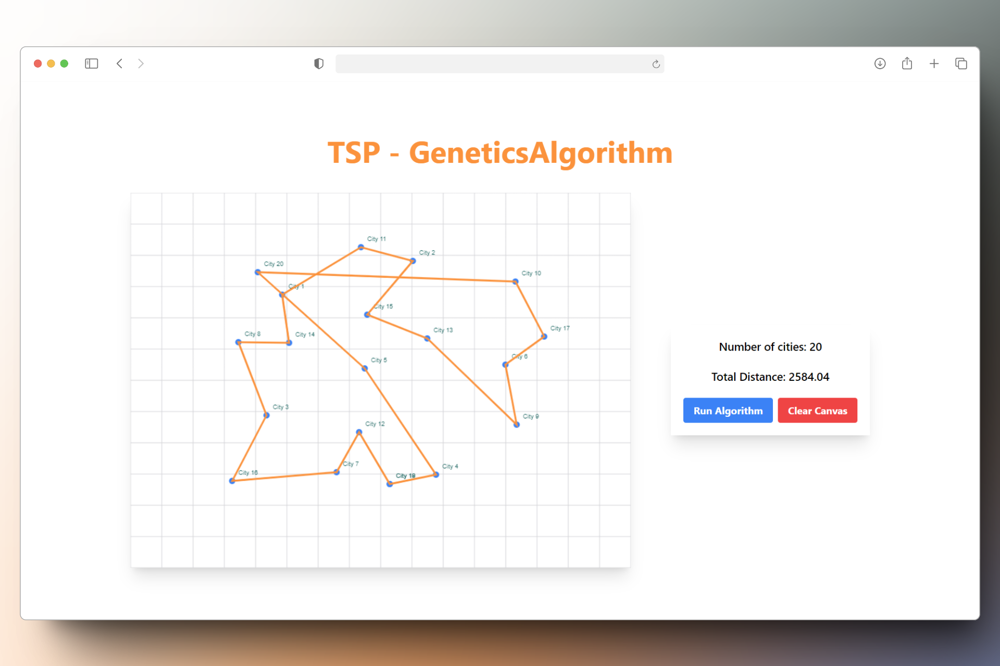

# Solucionador TSP con React y Algoritmos Genéticos

Este proyecto implementa una solución al Problema del Viajante (TSP) utilizando algoritmos genéticos y está desarrollado con React.

## Integrantes

- Echevarria Narrea Marko
- Celestino Rojas Angela Wini
- Benites Pardavé Eder Gustavo
- Ramos Garriazo Francis Alberto
- Mendoza Aymara Luis Ernesto

## Descripción

El Problema del Viajante (TSP) es un clásico problema de optimización combinatoria que busca determinar el recorrido más corto que permite a un viajante visitar un conjunto de ciudades y regresar a la ciudad de origen, visitando cada ciudad exactamente una vez.

En este proyecto, empleamos algoritmos genéticos para aproximar la solución del TSP. Los algoritmos genéticos son técnicas de búsqueda basadas en los principios de la evolución natural, como la selección, el cruce y la mutación, para encontrar soluciones óptimas o casi óptimas.

Este proyecto es nuestro proyecto final del curso de Diseño y Análisis de Algoritmos (DAA).

## Tecnologías Utilizadas

- **React JS:** Para la construcción de la interfaz de usuario.
- **JavaScript:** Para la implementación de la lógica del algoritmo genético.
- **Tailwind CSS:** Para el diseño y estilo de la aplicación.

## Funcionalidades

- **Visualización interactiva del recorrido del viajante:** Un panel donde se pueden colocar ciudades con cada clic. El panel contiene cuadrículas de 50x50 píxeles.
- **Ejecución del algoritmo:** Botón "Run Algorithm" para ejecutar el algoritmo y mostrar el resultado.
- **Limpieza del panel:** Botón "Clear Canvas" para iniciar de cero y volver a colocar ciudades.
- **Resultado del algoritmo:** El programa no muestra la evolución de las rutas, solo muestra la ruta final.

## Instalación

Para correr este proyecto localmente, sigue estos pasos:

1. Clona este repositorio:

    ```bash
    git clone https://github.com/S4vi0r17/TSP-Genetics-Solver.git
    ```

2. Navega al directorio del proyecto:

    ```bash
    cd TSP-Genetics-Solver
    ```

3. Instala las dependencias:

    ```bash
    npm install
    ```

4. Ejecuta la aplicación:

    ```bash
    npm run dev
    ```

La aplicación estará disponible en `http://localhost:5173/`.

## Uso

1. Abre la aplicación en tu navegador.
2. Coloca las ciudades haciendo clic en el panel.
3. Configura los parámetros del algoritmo genético en la interfaz.
4. Haz clic en "Run Algorithm" para ejecutar el algoritmo y ver la evolución del recorrido.
5. Si deseas empezar de nuevo, haz clic en "Clear Canvas".

### Captura de Pantalla



## Contribución

Si deseas contribuir a este proyecto, por favor sigue estos pasos:

1. Haz un fork del repositorio.
2. Crea una rama para tu nueva funcionalidad (`git checkout -b funcionalidad-nueva`).
3. Realiza tus cambios y haz commit (`git commit -m 'Añadir nueva funcionalidad'`).
4. Sube tus cambios (`git push origin funcionalidad-nueva`).
5. Abre un Pull Request.

**Guías de Estilo de Código:**
- Utiliza eslint para mantener la consistencia del código.
- Sigue las convenciones de nombrado de variables y funciones utilizadas en el proyecto.
